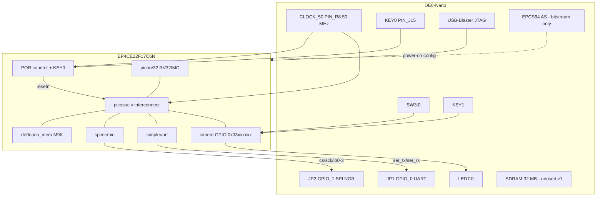
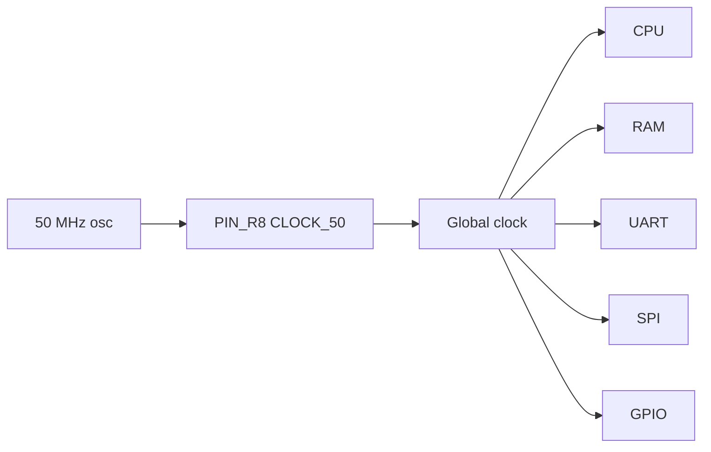
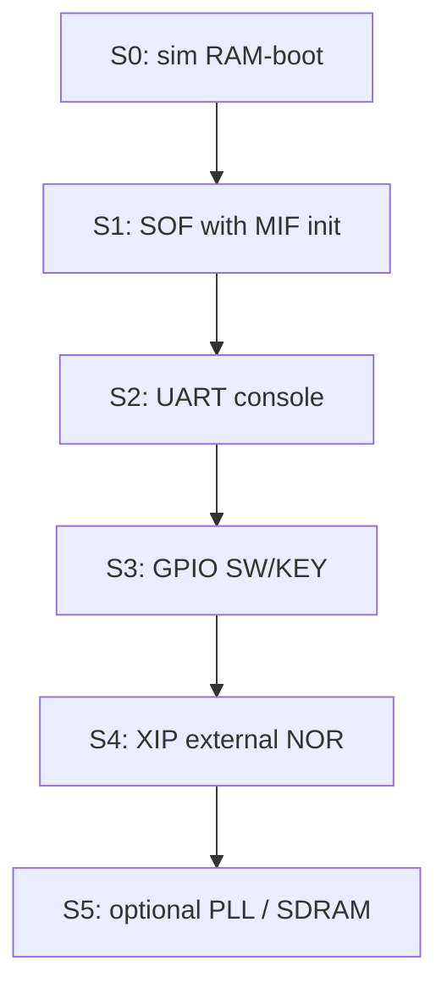

# PicoSoC Port to Terasic DE0-Nano

| Field | Value |
| --- | --- |
| **Title** | PicoSoC on Terasic DE0-Nano (Cyclone IV E) |
| **Author** | TBD |
| **Date** | 2026-08-31 |
| **Status** | Ready for implementation |
| **Upstream** | [YosysHQ/picorv32](https://github.com/YosysHQ/picorv32) `picosoc/` (ISC) |
| **Target board** | Terasic DE0-Nano, FPGA EP4CE22F17C6N |
| **Workspace** | `/home/recs/Documents/Grok_Test` (empty; new project) |

This document is an implementation-level FPGA port plan. An engineer should be able to create the repo, write the board top, constrain pins, build firmware, simulate, and bring the SoC up from it alone.

---

## Overview

PicoSoC is a small RISC-V SoC: PicoRV32 + SPI-flash execute-in-place (`spimemio.v`) + a tiny on-chip SRAM overlay + `simpleuart.v` + a memory-mapped GPIO window. Upstream demos target Lattice iCE40 boards (HX8K Breakout, iCEBreaker) whose configuration flash is a generic SPI NOR that the FPGA fabric can also XIP from. The Terasic DE0-Nano is a Cyclone IV E board with a 50 MHz oscillator, 8 LEDs, 2 keys, 4 DIP switches, 32 MB SDRAM, and an Altera EPCS64 Active Serial configuration device. It has no USB-UART.

The architectural mismatch that dominates this port is firmware storage. EPCS64 is not a drop-in for `spimemio`: it is a 1-bit Active Serial config flash accessed via ASDO/DATA0/DCLK/nCSO, it holds the FPGA bitstream, and it is not a generic Quad-SPI NOR. This design therefore **does not** XIP from EPCS64.

The port is a new repo (not an in-tree patch of picorv32) that pulls reusable PicoSoC RTL as a **git submodule of YosysHQ/picorv32 pinned to a SHA** and adds a DE0-Nano board wrapper, Quartus project, RISC-V firmware, and Icarus testbench. Bring-up is staged:

1. Simulation of CPU + on-chip M9K RAM + UART + GPIO.
2. RAM-resident firmware baked into the bitstream (no extra hardware).
3. LEDs / KEY / SW through the 0x03000000 user window.
4. Optional PicoSoC-faithful XIP from an **external** SPI NOR on GPIO_1 (JP2).
5. Optional later PR: 32 MB SDRAM as main memory.

Default clock is the onboard 50 MHz oscillator with no PLL. UART is 115200 8N1 on GPIO_0 (JP1) via an external USB-serial adapter whose **I/O voltage has been measured at 3.3 V** (many cheap FT232/CH340 boards drive 5 V on TXD and will damage Cyclone IV user I/O).

---

## Background & Motivation

### Upstream PicoSoC

Sources of record (YosysHQ/picorv32, `picosoc/`):

| File | Role |
| --- | --- |
| `picosoc.v` | SoC: PicoRV32 + `spimemio` + `simpleuart` + `picosoc_mem` + iomem decode |
| `spimemio.v` | SPI XIP controller (`spimemio` + `spimemio_xfer`) |
| `simpleuart.v` | 8N1 UART, divider at 0x02000004, data at 0x02000008 |
| `picorv32.v` | CPU (must be read **after** `picosoc.v` because of `PICORV32_REGS`) |
| `hx8kdemo.v` / `.pcf` | iCE40-HX8K board top + SB_IO tristate + 6-bit POR counter |
| `icebreaker.v` / `.pcf` | iCEBreaker top; `PICOSOC_MEM ice40up5k_spram`; MEM_WORDS=32768 |
| `firmware.c`, `start.s`, `sections.lds` | Demo firmware, board ifdef `HX8KDEMO` / `ICEBREAKER` |
| `hx8kdemo_tb.v`, `spiflash.v` | Icarus TB + SPI flash behavioral model |

Memory map (picosoc README):

| Address range | Description |
| --- | --- |
| `0x00000000` .. `0x00FFFFFF` | Internal SRAM overlay (reads beyond physical SRAM fall through to flash) |
| `0x01000000` .. `0x01FFFFFF` | External serial flash |
| `0x02000000` | SPI flash controller config |
| `0x02000004` | UART clock divider |
| `0x02000008` | UART send/recv data (`-1` if RX empty) |
| `0x03000000` .. `0xFFFFFFFF` | Memory-mapped user peripherals |

Reset vector is `PROGADDR_RESET = 32'h0010_0000` (1 MiB into flash). HX8K SRAM is `MEM_WORDS=256` (1 KiB). iCEBreaker uses 128 KiB SPRAM. Firmware UART divider is hardcoded `104` for a 12 MHz iCE40 clock (~115200 baud). HX8K `start.s` **zeros all of SRAM** from 0 up to `sp` — that is safe only because `.text` lives in flash.

Board tops are the only iCE40-specific pieces: `SB_IO` tristate buffers, pin constraints, POR counter, LED GPIO at `iomem_addr[31:24]==8'h03`, and `MEM_WORDS`. `picosoc.v` / `spimemio.v` / `simpleuart.v` / `picorv32.v` are reusable.

### DE0-Nano current state

| Item | Fact | Source |
| --- | --- | --- |
| FPGA | Intel/Altera Cyclone IV E **EP4CE22F17C6N**, FBGA-256, speed -6 | Terasic DE0-Nano User Manual; ordering code |
| Logic | 22,320 LEs, 66 18×18 multipliers, 4 PLLs | Terasic product page |
| On-chip RAM | **594 kbit**, **66 M9K** (9 kbit each; 66 KiB usable data) | Cyclone IV handbook / Terasic |
| Clock | 50 MHz oscillator on **PIN_R8** (`CLOCK_50`, dedicated `CLK15`) | User manual §3; LiteX `terasic_de0nano.py` |
| User I/O | 8 green LEDs, 2 debounced push-buttons (KEY), 4 DIP switches | User manual Tables 3-1..3-3 |
| SDRAM | 32 MB, 16-bit, typically ISSI IS42S16160x, 4M × 16 × 4 banks, 3.3 V LVTTL, `DRAM_CLK` on PIN_R4 | User manual; Intel FPGA-UP SDRAM tutorial |
| Config flash | **Spansion/Altera EPCS64** (64 Mbit AS), pins DATA0=H2, DCLK=H1, nCSO=D2, ASDO=C1 | User manual; LiteX `epcs` |
| UART | **None onboard.** TTL UART via GPIO header + USB-serial dongle | User manual; FPGArduino / LiteX practice |
| I/O voltage | 3.3 V LVTTL on user I/O | User manual |
| Programmer | Onboard USB-Blaster (JTAG) | User manual |

There is no in-tree PicoSoC port. Closest prior art is [ZiCog/xoro](https://github.com/ZiCog/xoro): PicoRV32 on DE0-Nano with on-chip RAM + UART at 38400 baud, **no** PicoSoC `spimemio` XIP. That project shows a **simple** PicoRV32 + RAM + UART wrapping this board is viable; it does **not** document `BARREL_SHIFTER` / `ENABLE_FAST_MUL`, so it is not evidence that PicoSoC with barrel+fast-mul closes 50 MHz on a C6. UART-on-GPIO is the console path.

### Pain points this port must solve

1. **Firmware storage / XIP.** iCE40 demos share one SPI NOR for bitstream and firmware (`iceprog -o 1M`). DE0-Nano's EPCS64 is an Altera configuration device. `spimemio` cannot be wired to it as if it were W25Q.
2. **iCE40 primitives.** `hx8kdemo.v` / `icebreaker.v` use `SB_IO`. Those must become inferred `inout` / `altiobuf`.
3. **Toolchain.** iCE40 Makefile is `yosys synth_ice40` + `nextpnr-ice40` + `icepack`. Cyclone IV E is a Quartus Prime Lite/Standard device. Yosys `synth_intel -family cycloneive` is experimental; nextpnr has **no** production Cyclone IV E backend (nextpnr-mistral is Cyclone V only).
4. **Clock and UART math.** 50 MHz vs 12 MHz changes the UART divider, SPI SCK (`sysclk/2` = 25 MHz in `spimemio_xfer`), and timing closure.
5. **RAM-boot vs XIP startup.** `start.s` wipes SRAM. A RAM-resident image cannot use that loop unmodified.
6. **No USB-UART.** Pinout, 3.3 V vs 5 V **signals** (not just the 5 V power pin), and GND must be specified so a first console session works without destroying I/O.

---

## Goals & Non-Goals

### Goals

- New repo that builds a PicoSoC-class RISC-V SoC for DE0-Nano.
- Preserve upstream `picosoc.v`, `spimemio.v`, `simpleuart.v`, `picorv32.v` with copyright headers (ISC). Board-specific code is a new top + constraints + firmware ifdef.
- **MVP:** CPU + 32 KiB M9K RAM + UART + LED/KEY/SW GPIO, firmware in bitstream, 115200 8N1 console, LED blink / PicoSoC menu subset (RAM-boot memtest is **`0x5000..0x5FFF`**, not the stack; no flash menu).
- **PicoSoC-equivalent mode:** XIP from external SPI NOR on GPIO_1, reset vector `0x00100000`, same memory map as upstream.
- Quartus Prime Lite project (`.qpf` / `.qsf` / `.sdc`) plus a Makefile that also builds firmware with `riscv32-unknown-elf-gcc`.
- Icarus Verilog testbench patterned on `hx8kdemo_tb.v`.
- Documented bring-up sequence and pin table an FPGA engineer can wire on the first attempt.

### Non-Goals

- Using EPCS64 as XIP firmware storage (ASMI / 1-bit AS, bitstream collision). Deferred, not recommended.
- SDRAM as CPU main memory in the first bring-up (optional later PR).
- USB, Ethernet, Linux, caches, or a new bus fabric.
- Open-source bitstream generation as the supported flow.
- QSPI/DDR flash modes on day one (single-SPI `03h` is the XIP bring-up mode).
- Accelerometer, ADC, I2C EEPROM as required peripherals (optional later at `0x03000010+`).
- Formal verification of PicoRV32 (already upstream).
- Windows-only GUI-only flow; the documented path is command-line `quartus_*` + Make.

---

## Key Decisions

1. **Firmware storage is dual-mode; EPCS64 is not the XIP device.**
   - **RAM-boot (default MVP):** `PROGADDR_RESET = 0x00000000`, firmware in M9K, no extra chips. Silicon init is an explicit `altsyncram` with `fw/firmware.mif` (so `quartus_cdb --update_mif` works). Simulation init is inferred RAM + `$readmemh("fw/firmware.mem")`.
   - **XIP mode (PicoSoC-faithful):** `PROGADDR_RESET = 0x00100000`, external **W25Q64JV 3.3 V SOIC-8 breakout** on GPIO_1 (JP2), `spimemio` unchanged. Flash preload / programmer image is `fw/firmware_xip.hex` from `objcopy -O verilog` (byte-addressed VMA `0x00100000`). **Never** feed `makehex.py` output to `spiflash.v`. Pinout is the JP2 cluster already specified (CS/SCK/IO0–3, 3.3 V on pin 29, GND on pin 12).
   - **Build switch:** one top (`de0nano.v`), one pinout, `make BOOT=ram|xip`. Verilog uses **presence-only** `` `ifdef BOOT_FROM_RAM `` (define it for RAM-boot, **omit** it for XIP — never `BOOT_FROM_RAM=0`). `MEM_WORDS` and the reset vector are `localparam`s derived from that ifdef inside `de0nano.v`, not QSF macros and not a `?:` on an undeclared identifier. Firmware `-D` is independent (`DE0NANO_RAM_BOOT` xor `DE0NANO_XIP`).
   - **Not chosen:** EPCS64 via ASMI. It is 1-bit, shares AS pins with configuration, and is not a `spimemio` NOR. Leftover EPCS space after the bitstream is not a linear firmware image.
   - **Not chosen for v1:** SDRAM main memory. Large controller + PLL phase shift + refresh; tracked as PR-8.

2. **System clock is 50 MHz from PIN_R8, no PLL in v1.**
   - PIN_R8 is dedicated `CLK15` and can feed a PLL later.
   - PicoRV32 + PicoSoC is expected in the low thousands of LEs (unsourced estimate; EP4CE22 has 22 kLE of headroom either way). ZiCog/xoro shows a **simple** PicoRV32+RAM+UART at this board's 50 MHz; barrel shifter + fast mul are **not** verified by that repo. Closing 50 MHz Slow 85 °C is a **PR-2 STA gate**, not a given.
   - **STA fallback (ordered, final):** (1) drop `BARREL_SHIFTER` first and **stay at 50 MHz** — UART divider stays **434**. (2) ALTPLL 50 → 25 MHz only if shifter-off still misses Slow 85 °C Fmax (PR-7). Do not drop to 25 MHz as the first move.
   - UART divider: write `SYSCLK_HZ / 115200` = **434** at 50 MHz, matching the PicoSoC README (`clk / baud`) and upstream `104` at 12 MHz. In `simpleuart.v` the TX shifter fires when `send_divcnt > cfg_divider`, so the bit period is **N+1** cycles → `50e6/435 ≈ 114943` baud (**~0.22%** error, inside UART tolerance). The same off-by-one exists on iCE40 (104 → 105 cycles). Do not claim 115207 baud / 0.006%.

3. **SRAM size: 32 KiB (`MEM_WORDS = 8192`) for RAM-boot; 8 KiB (`MEM_WORDS = 2048`) for XIP scratchpad.**
   - 66 M9K × 1024 bytes ≈ 66 KiB. 32 KiB ≈ 32 M9K (48% of BRAM). XIP scratchpad stays 8 KiB.
   - Silicon RAM is an explicit `altsyncram` (M9K, byte enables, `init_file` MIF). Simulation uses inferred `reg [31:0] mem[]` + `$readmemh`. Do **not** rely on Quartus inferring `picosoc_mem`.
   - Firmware `MEM_TOTAL` **must** equal `4*MEM_WORDS` (upstream HX8KDEMO comments `0x200 /* 2 KB */` while hardware is 1 KiB — do not copy that bug). RAM-boot `MEM_TOTAL = 0x8000`, `STACKADDR = 0x8000`.
   - RAM-boot layout (32 KiB; memtest is **not** the live stack):
     | Range | Size | Use |
     | --- | --- | --- |
     | `0x0000 .. 0x4FFF` | 20 KiB | `.text` / `.data` / `.bss` / heap. `ASSERT(_heap_start <= 0x5000)`. |
     | `0x5000 .. 0x5FFF` | 4 KiB | Memtest window. |
     | `0x6000 .. 0x7FFF` | 8 KiB | Stack; `STACKADDR = 0x8000` grows down. |

4. **UART on GPIO_0 (JP1), SPI flash on GPIO_1 (JP2), 3.3 V I/O only.**
   - Matches LiteX DE0-Nano serial **pin numbers** so published JP1:8/10/12 wiring applies.
   - **Do not assume** FT232 / CP2102 / CH340 dongles are 3.3 V. Many strap VCCIO to 5 V. Cyclone IV E user I/O abs-max V_I is typically 4.0 V — a 5 V **signal** on `UART_RX` (`PIN_B4`) will damage the FPGA. Require a measured 3.3 V TXD (or a FET/level shifter) before connecting. S2 lab step 0 is a DMM check.
   - SPI NOR clustered next to JP2 GND (pin 12) and 3.3 V (pin 29). Never power flash or UART from JP pin 11 (5 V). Keep SPI Dupont wires **< 10 cm**.

5. **Replace `SB_IO` with inferred bidirectional I/O, not `altiobuf` megafunction as a hard dependency.**
   ```verilog
   assign flash_io0 = flash_io0_oe ? flash_io0_do : 1'bz;
   assign flash_io0_di = flash_io0;
   ```
   Quartus infers `ALTIOBUF`. Explicit `altiobuf` is allowed if inference fails.

6. **Quartus Prime Lite/Standard is the only supported bitstream flow.**
   - Cyclone IV E is still in Quartus Prime Lite **24.1 / 25.1** device packs (`cyclone-*.qdz`).
   - Recommended: Lite 23.1 or 24.1 (or 18.1, the University Program vintage).
   - Yosys `synth_intel -family cycloneive` is experimental; nextpnr has no Cyclone IV E production arch. Do not reuse `synth_ice40` Makefile targets.

7. **Keep `picosoc.v` parameterized; do not fork the interconnect.**
   - `MEM_WORDS`, `PROGADDR_RESET`, `BARREL_SHIFTER`, `ENABLE_MUL` / `ENABLE_DIV` / `ENABLE_FAST_MUL` / `ENABLE_COMPRESSED` / `ENABLE_COUNTERS` / `ENABLE_IRQ_QREGS` already exist on `picosoc`. `ENABLE_IRQ` is **hardcoded** `ENABLE_IRQ(1)` on the inner `picorv32` instance — do not put it in the board `#(...)` list (it will not compile).
   - Set `` `PICOSOC_MEM `` from the **QSF** (`set_global_assignment -name VERILOG_MACRO "PICOSOC_MEM=de0nano_mem"`), which is order-independent, rather than relying on a Yosys-only `` `error `` guard. An optional `de0nano_defs.v` may repeat the define for Icarus. `$error` is allowed in the TB only.
   - `picosoc.v` must still appear **before** `picorv32.v` because of `` `define PICORV32_REGS picosoc_regs ``.

8. **CPU feature set: RV32IMC, barrel shifter on, fast mul on, `ENABLE_DIV=0` for v1 (final).**
   - Icebreaker: `BARREL_SHIFTER=0`, `ENABLE_FAST_MUL=1`, `ENABLE_DIV=0`.
   - DE0-Nano has 66 DSP 18×18 and plenty of LEs, so **try** barrel shifter on at 50 MHz. If STA fails: drop the shifter **first**, keep 50 MHz / UART 434. PLL 25 MHz is PR-7 only if that is still not enough.
   - `ENABLE_COMPRESSED=1`, `ENABLE_COUNTERS=1`. IRQ is on via the hardcoded `picosoc` wiring; `ENABLE_IRQ_QREGS=0`. Do not enable `ENABLE_DIV` in v1.

9. **Reset is a 6-bit POR counter **and** a synchronized KEY0 (active-low).**
   - Saturating counter as in `hx8kdemo.v` (`resetn = &reset_cnt`), but hx8kdemo has **no** external async button — KEY0 is extra.
   - Two flip-flops synchronize `KEY[0]` onto `clk` before it clears the counter (chip-debounced, still asynchronous to the 50 MHz domain).
   - `POWER_UP_DONT_CARE OFF` so `reset_cnt = 6'd0` is honored after configuration.
   - KEY1 is a user GPIO input, not CPU reset.

10. **Firmware macros and artifacts are a closed matrix, not three overlapping `-D` flags.**
    - Always `-DDE0NANO`. Exactly one of `-DDE0NANO_RAM_BOOT` **xor** `-DDE0NANO_XIP`. `start.S` (capital S, preprocessed) uses the same pair.
    - Two **different** load images that must not share the name `firmware.hex`: `fw/firmware.mem` (word `$readmemh` / `makehex.py`) for M9K; `fw/firmware_xip.hex` (`objcopy -O verilog`) for `spiflash.v` and the W25Q. Quartus Intel HEX is never used.

11. **License: ISC, preserve Claire Xenia Wolf copyright on submodule files.** New board files: ISC or MIT, copyright the port author, note "based on PicoSoC". PicoRV32/PicoSoC is a **git submodule** of `https://github.com/YosysHQ/picorv32`, pinned to commit `a473fc8fca393771d83b0ffcf0b14db3393339d8` (`main` as of 2026-07-31). Do not vendor copies. Record the SHA in README; bump it only in a dedicated PR.

12. **SignalTap is off in the default SOF (final).** Adding it consumes M9K and inserts a JTAG hub. How to add: Quartus SignalTap II File, sample `clk`, 1–2k depth, triggers `resetn`, `mem_valid`, `ser_tx`, and for XIP `spimem_ready`. Keep the `.stp` out of the default QSF; document the file under `quartus/signaltap.stp` as optional.

---

## Proposed Design

### Project layout

New repository rooted at the empty workspace (suggested name `picosoc-de0nano`):

```
picosoc-de0nano/
├── README.md
├── LICENSE                          # ISC, plus third-party notices
├── Makefile                         # top-level: fw, sim, quartus, prog
├── third_party/picorv32/            # git submodule YosysHQ/picorv32 @ a473fc8fca393771d83b0ffcf0b14db3393339d8
│   ├── picorv32.v
│   └── picosoc/
│       ├── picosoc.v
│       ├── spimemio.v
│       ├── simpleuart.v
│       └── spiflash.v               # sim model only
├── rtl/
│   ├── de0nano.v                    # board top (module de0nano)
│   ├── de0nano_defs.v               # optional; QSF VERILOG_MACRO is the source of truth
│   ├── de0nano_mem.v                # sim: inferred+$readmemh(.mem); synth: altsyncram+.mif
│   └── de0nano_pll.v                # OPTIONAL altpll, unused in v1
├── boards/de0nano/
│   ├── pins.qsf                     # pin assignments + I/O standard
│   ├── de0nano.sdc                  # 20 ns CLOCK_50
│   └── wiring.md                    # UART dongle + SPI NOR hookup
├── quartus/
│   ├── de0nano.qpf
│   ├── de0nano.qsf                  # includes pins.qsf, file list
│   └── Makefile
├── fw/
│   ├── firmware.c                   # -DDE0NANO plus RAM_BOOT xor XIP
│   ├── start.S                      # capital S: gcc preprocesses DE0NANO_* 
│   ├── sections.lds                 # cpp → de0nano_sections.lds (upstream pattern)
│   ├── makehex.py                   # bin → word .mem for M9K (assert len <= 4*WORDS)
│   └── Makefile                     # also objcopy -O verilog → firmware_xip.hex
├── sim/
│   ├── de0nano_tb.v
│   └── Makefile
└── scripts/
    ├── bin2mif.py                   # firmware.bin → firmware.mif (32-bit, depth MEM_WORDS)
    └── prog.sh                      # quartus_pgm wrapper
```

PR-1: `git submodule add https://github.com/YosysHQ/picorv32 third_party/picorv32` then `git -C third_party/picorv32 checkout a473fc8fca393771d83b0ffcf0b14db3393339d8`. Do not "clean up" copyright headers. Do not vendor copies.

### Block diagram



### Memory map (this port)

Unchanged from PicoSoC except physical SRAM size and the GPIO register bitfields.

| Address | Size / access | Contents |
| --- | --- | --- |
| `0x00000000` | `MEM_WORDS * 4` bytes, RW | On-chip M9K. RAM-boot: `.text/.data/.bss`. XIP: scratchpad overlay. |
| `0x00000000 + 4*MEM_WORDS` .. `0x00FFFFFF` | R | Flash window (XIP). Unmapped garbage in RAM-boot if no NOR. |
| `0x01000000` .. `0x01FFFFFF` | R | `spimemio` 24-bit flash address (byte address = `mem_addr[23:0]`) |
| `0x02000000` | RW | SPI config (upstream bitfields, see README) |
| `0x02000004` | RW | UART divider. Write `SYSCLK_HZ/115200` (**434** at 50 MHz). Bit period is N+1 cycles (~114943 baud). |
| `0x02000008` | RW | UART data. Read `-1` if empty. TX waits via `reg_dat_wait`. |
| `0x03000000` | RW | GPIO (see bitfield below) |
| `0x03000004` .. | — | Reserved for later ADC/accel |

**GPIO at `0x03000000`** (replaces hx8kdemo 8-bit LED-only register):

| Bits | Direction | Function |
| --- | --- | --- |
| `[7:0]` | RW | LED[7:0], 1 = on (active high) |
| `[11:8]` | R | SW[3:0] raw (DOWN=1 per user manual) |
| `[13:12]` | R | KEY[1:0] raw (unpressed=1, pressed=0) |
| `[31:14]` | R | 0 |

Writes use `iomem_wstrb` byte enables, same as `hx8kdemo.v`. Reads return `{18'b0, KEY, SW, led_reg}`. Do not write 1s into input fields; the register only stores LED bits.

### CPU / SoC parameters

Board top (`de0nano.v`) **derives** `MEM_WORDS` and the reset vector from presence-only `` `ifdef BOOT_FROM_RAM ``. Never write `BOOT_FROM_RAM ? ... : ...` (undeclared if the macro is omitted) and never pass `BOOT_FROM_RAM=0` (`` `ifdef `` stays true, so XIP would still load the RAM-boot MIF).

```verilog
`ifdef BOOT_FROM_RAM
    localparam integer MEM_WORDS     = 8192;           // 32 KiB RAM-boot
    localparam [31:0]  PROGADDR_RST  = 32'h0000_0000;
`else
    localparam integer MEM_WORDS     = 2048;           // 8 KiB XIP scratchpad
    localparam [31:0]  PROGADDR_RST  = 32'h0010_0000;
`endif

picosoc #(
    .BARREL_SHIFTER    (1),
    .ENABLE_MUL        (0),
    .ENABLE_DIV        (0),
    .ENABLE_FAST_MUL   (1),
    .ENABLE_COMPRESSED (1),
    .ENABLE_COUNTERS   (1),
    .ENABLE_IRQ_QREGS  (0),
    .MEM_WORDS         (MEM_WORDS),
    .STACKADDR         (4 * MEM_WORDS),
    .PROGADDR_RESET    (PROGADDR_RST),
    .PROGADDR_IRQ      (32'h0000_0000)
) soc ( ... );
```

Do **not** pass `.ENABLE_IRQ(1)` — `picosoc.v` already hardcodes it on `picorv32`. `STACKADDR` is the initial `x2` (end of SRAM). `picosoc` then instantiates `` `PICOSOC_MEM #(.WORDS(MEM_WORDS)) `` with **its** parameter, so `de0nano_mem.WORDS` follows the localparam — do not also define a `MEM_WORDS` VERILOG_MACRO (that would fight `picosoc.v`'s default of 256 if the `#(...)` override were omitted, and is redundant if it is present).

`BOOT_FROM_RAM` is **compile-time presence** (`make BOOT=ram|xip`), not a run-time strap and not a second top-level.

| | RAM-boot (`BOOT=ram`, default) | XIP (`BOOT=xip`) |
| --- | --- | --- |
| QSF / Icarus | **define** `BOOT_FROM_RAM` (Quartus: `VERILOG_MACRO "BOOT_FROM_RAM=1"`; Icarus: `-DBOOT_FROM_RAM`) | **omit** the macro. Never `=0`. |
| `MEM_WORDS` (localparam) | 8192 (32 KiB) | 2048 (8 KiB) |
| `PROGADDR_RESET` | `0x00000000` | `0x00100000` |
| Firmware `-D` (required) | `-DDE0NANO -DDE0NANO_RAM_BOOT` | `-DDE0NANO -DDE0NANO_XIP` |
| `MEM_TOTAL` (`firmware.c` **and** `sections.lds`) | `0x8000` | `0x2000` |
| Linker | all sections `>RAM`, `_sidata = _sdata` | `FLASH ORIGIN=0x00100000`, `.text >FLASH` |
| `start.S` SRAM wipe | **omitted** (`DE0NANO_RAM_BOOT`) | kept |
| M9K init file | `fw/firmware.mif` / `.mem` required | unused / zeros (`start.S` clears SRAM) |
| Load image for RAM | `fw/firmware.mem` (`makehex.py`) | n/a |
| Load image for flash/TB | n/a | `fw/firmware_xip.hex` (`objcopy -O verilog`) |

### Clocking



- No PLL in v1. `CLOCK_50` is the SoC `clk`.
- SDC always contains `create_clock -name CLOCK_50 -period 20.000 [get_ports CLOCK_50]`, `derive_clock_uncertainty`, and a **generated 25 MHz clock on `FLASH_SCK`** (see Pin Constraints). UART remains a false path. Flash I/O is **not** a false path — `spimemio` wiggles JP2 even in RAM-boot.
- `spimemio_xfer` toggles `flash_clk` every sysclk (`flash_clk <= !flash_clk && !flash_csb`), so **SPI SCK = 25 MHz**. W25Q `03h` Read is spec'd to 50 MHz; 25 MHz is conservative vs the chip, **not** vs Dupont wire SI. Keep cables **< 10 cm**. DDR mode uses `negedge clk` in `spimemio.v` — leave DDR off until STA is clean.
- Optional PLL (PR-7): `altpll` 50 MHz in, c0=50 MHz (or 25), c1=50 MHz with `-3 ns` phase for `DRAM_CLK` if SDRAM is added. Cyclone IV E has 4 PLLs; PIN_R8 can feed PLL1. Firmware `SYSCLK_HZ` and `UART_DIV` must track c0.

**Fmax budget (severity if missed: medium; PR-2 merge gate).** PicoRV32 barrel shifter is the usual critical path. Icebreaker disables it; xoro does not prove it at 50 MHz. If Quartus reports Fmax < 50 MHz Slow 1200 mV 85 °C, apply **in this order**:

1. Set `BARREL_SHIFTER=0` (icebreaker choice). **Stay at 50 MHz.** UART divider stays **434** (`SYSCLK_HZ` unchanged). Land this in PR-2 if needed.
2. Only if (1) still misses Fmax: PR-7 ALTPLL 50 → 25 MHz and `SYSCLK_HZ=25000000` so UART div becomes `217`.
3. Do not enable `ENABLE_MUL` (slow multi-cycle) and `ENABLE_FAST_MUL` together; picosoc passes both through, FAST_MUL wins when set. `ENABLE_DIV` stays 0.

### Reset strategy

```verilog
reg [5:0] reset_cnt = 0;
reg [1:0] key0_sync = 2'b11;   // KEY0 unpressed = 1
wire resetn = &reset_cnt;

always @(posedge clk) begin
    key0_sync <= {key0_sync[0], KEY[0]};
    if (!key0_sync[1])
        reset_cnt <= 6'd0;
    else if (!resetn)
        reset_cnt <= reset_cnt + 1'b1;
end
```

- Power-on: `reset_cnt` starts at 0, `resetn` asserts after 63 cycles (~1.26 µs at 50 MHz). Same saturating-counter idea as `hx8kdemo.v` lines 47–52, **plus** a 2FF synchronizer that hx8kdemo does not need (it has no async button).
- KEY0 pressed (0): force reset after two clocks. KEY0 is chip-debounced on the PCB (100 kΩ pull-up, 1 nF, 120 Ω series — schematic "CLOCK & LED & BUTTON & SWITCH") but is still asynchronous to `CLOCK_50`.
- QSF: `set_global_assignment -name POWER_UP_DONT_CARE OFF` so the `= 0` reset of `reset_cnt` is not optimized to X.
- Do not reset on KEY1.

### Board top module

```verilog
module de0nano (
    input        CLOCK_50,
    input  [1:0] KEY,
    input  [3:0] SW,
    output [7:0] LED,
    // UART on JP1
    output       UART_TX,     // FPGA → adapter RXD
    input        UART_RX,     // adapter TXD → FPGA
    // External SPI NOR on JP2 — always driven; spimemio emits FFh/ABh at reset
    output       FLASH_CS_N,
    output       FLASH_SCK,
    inout        FLASH_IO0,
    inout        FLASH_IO1,
    inout        FLASH_IO2,
    inout        FLASH_IO3
);
```

LED/GPIO process copies `hx8kdemo.v` (ready in one cycle when `iomem_addr[31:24]==8'h03`) and extends the read data with SW/KEY.

SPI tristate (four copies):

```verilog
assign FLASH_IO0 = flash_io0_oe ? flash_io0_do : 1'bz;
assign flash_io0_di = FLASH_IO0;
```

Set Quartus `WEAK_PULL_UP_RESISTOR ON` for FLASH_IO2/IO3 so unconnected QSPI pins (WP#/HOLD#) idle high if a SOIC-8 is wired for 1-bit only.

**RAM-boot still drives JP2.** `picosoc` always instantiates `spimemio`. On reset it sends `FFh` then `ABh` (release from deep power-down) with CS low and SCK at 25 MHz (`spimemio.v` states 0–3). FLASH_* ports are top-level in every SOF — they do not float. Harmless with nothing attached; if a W25Q is already wired it will be woken and then ignored. A CPU fetch past `4*MEM_WORDS` in RAM-boot waits forever on `spimem_ready`. The RAM-boot TB must `$fatal` if `soc.spimem_ready` is waited more than N cycles (e.g. 10 000). Optional later: a dummy `spimemio` / `valid` tie-off behind `BOOT_FROM_RAM` if pin chatter is unwanted.

**Macros (no `` `error ``).** Quartus `VERILOG_INPUT_VERSION VERILOG_2001` does not implement Yosys `` `error ``. Source of truth is QSF. `BOOT_FROM_RAM` is **presence-only**: the Quartus `=1` is define syntax, not a boolean you may set to 0.

```
set_global_assignment -name VERILOG_MACRO "PICOSOC_MEM=de0nano_mem"
set_global_assignment -name VERILOG_MACRO "BOOT_FROM_RAM=1"
# XIP: delete the BOOT_FROM_RAM line. Do not write BOOT_FROM_RAM=0.
# MEM_WORDS is a localparam in de0nano.v — not a VERILOG_MACRO.
```

Icarus RAM-boot: `-DPICOSOC_MEM=de0nano_mem -DBOOT_FROM_RAM -DSIMULATION` (no `=1` needed). Icarus XIP: omit `-DBOOT_FROM_RAM`. Keep this file order for `PICORV32_REGS` (picosoc before picorv32):

1. `rtl/de0nano.v`
2. `rtl/de0nano_mem.v`
3. `third_party/picorv32/picosoc/picosoc.v`
4. `third_party/picorv32/picosoc/spimemio.v`
5. `third_party/picorv32/picosoc/simpleuart.v`
6. `third_party/picorv32/picorv32.v`

### On-chip memory (`de0nano_mem`)

`picosoc.v` instantiates `` `PICOSOC_MEM #(.WORDS(MEM_WORDS)) `` using the parameter passed from `de0nano.v`'s localparam, and **does not** pass `INIT_FILE`. Init is therefore internal to `de0nano_mem`, switched by the same **presence-only** `` `ifdef BOOT_FROM_RAM `` (so omitting the macro for XIP both skips the MIF and, via the localparam, selects 2048 words / reset `0x00100000`).

**Two images, two names — never `firmware.hex`:**

| File | Format | Consumer |
| --- | --- | --- |
| `fw/firmware.mem` | Word `$readmemh`: one 32-bit little-endian word per line, **no** `@` (or `@` **word** addresses). Produced by `fw/makehex.py`. | Icarus inferred RAM |
| `fw/firmware.mif` | Quartus MIF, WIDTH=32, DEPTH=`MEM_WORDS`. Produced by `scripts/bin2mif.py` from the same `.bin`. | `altsyncram` `init_file` |
| `fw/firmware_xip.hex` | `$(CROSS)objcopy -O verilog` byte-addressed Verilog hex. ELF VMA `@100000` lands at byte offset 1 MiB. | `spiflash.v` `+firmware=` and W25Q programmers |

Quartus `.hex` / `HEX_FILE` is **Intel HEX**. Do not name the word `$readmemh` file `.hex`, and do not add it as a `HEX_FILE`.

**Silicon source of truth is `altsyncram` + MIF** so `quartus_cdb --update_mif` is real, not hoped-for inference:

```verilog
module de0nano_mem #(
    parameter integer WORDS = 8192
) (
    input             clk,
    input       [3:0] wen,
    input      [21:0] addr,
    input      [31:0] wdata,
    output     [31:0] rdata
);
`ifdef SIMULATION
    // Icarus / Verilator: inferred array. Path is relative to the vvp cwd (repo root).
    reg [31:0] mem [0:WORDS-1];
    initial begin
`ifdef BOOT_FROM_RAM
        $readmemh("fw/firmware.mem", mem);
`endif
    end
    reg [31:0] rdata_q;
    assign rdata = rdata_q;
    always @(posedge clk) begin
        rdata_q <= mem[addr[$clog2(WORDS)-1:0]];
        if (wen[0]) mem[addr[$clog2(WORDS)-1:0]][ 7: 0] <= wdata[ 7: 0];
        if (wen[1]) mem[addr[$clog2(WORDS)-1:0]][15: 8] <= wdata[15: 8];
        if (wen[2]) mem[addr[$clog2(WORDS)-1:0]][23:16] <= wdata[23:16];
        if (wen[3]) mem[addr[$clog2(WORDS)-1:0]][31:24] <= wdata[31:24];
    end
`else
    // Quartus: explicit M9K so init_file is a first-class MIF (update_mif works).
    // Path is relative to the .qpf directory (quartus/) → ../fw/firmware.mif
    localparam AW = $clog2(WORDS);
`ifdef BOOT_FROM_RAM
    localparam INIT_FILE = "../fw/firmware.mif";
`else
    localparam INIT_FILE = "UNUSED";
`endif
    wire [AW-1:0] addr_w = addr[AW-1:0];
    altsyncram #(
        .operation_mode          ("SINGLE_PORT"),
        .width_a                 (32),
        .widthad_a               (AW),
        .numwords_a              (WORDS),
        .width_byteena_a         (4),
        .byte_size               (8),
        .outdata_reg_a           ("CLOCK0"),
        .ram_block_type          ("M9K"),
        .init_file               (INIT_FILE),
        .init_file_layout        ("PORT_A"),
        .intended_device_family  ("Cyclone IV E")
    ) ram (
        .clock0    (clk),
        .address_a (addr_w),
        .wren_a    (|wen),
        .byteena_a (wen),
        .data_a    (wdata),
        .q_a       (rdata),
        .aclr0     (1'b0), .aclr1(1'b0),
        .addressstall_a(1'b0), .rden_a(1'b1)
        // remaining ports tied off per MegaWizard defaults
    );
`endif
endmodule
```

`$clog2` is Verilog-2005; if `VERILOG_2001` rejects it, compute `AW` with a function or a parameter `ADDR_BITS = 13` for 8192 words / `11` for 2048. QSF may use `SYSTEMVERILOG_FILE` for `de0nano_mem.v` only.

PR-2 **gates** (not PR-6):

1. `quartus_map` report lists the `altsyncram` with `init_file = ../fw/firmware.mif` and M9K count ≈ 16 for RAM-boot.
2. Optional `make quartus-blink`: no CPU, counter onto LED[0] — proves CLOCK/KEY/LED pins if a RAM-init SOF is dark (cannot otherwise distinguish bad init from bad clock/reset/pin map).
3. `make update-mif` (rebuild `.mif` + `quartus_cdb --update_mif` + `quartus_asm`) is demonstrated in PR-2, not deferred.

M9K budget:

| Use | Blocks | Bytes |
| --- | --- | --- |
| `de0nano_mem` 32 KiB RAM-boot | ≤ 32 | 32768 |
| `de0nano_mem` 8 KiB XIP | ≤ 8 | 8192 |
| PicoRV32 `picosoc_regs` | 0 (LE / LUT RAM; async `assign rdata1 = regs[...]`. Cyclone IV E has **no MLAB**; 32×32 dual async-read will not use M9K) | 128 |
| Remaining of 66 (RAM-boot) | ≥ 34 | — |

Do not try 64 KiB in v1 (64 M9K leaves almost nothing for other inferred RAMs). SignalTap, if added later, comes out of the remaining 34 M9K.

---

## Pin Constraints

All I/O standard **3.3-V LVTTL**. Device `EP4CE22F17C6`, family `Cyclone IV E`. Sources: Terasic DE0-Nano User Manual Tables 3-1..3-3, Terasic System Builder QSF, LiteX `terasic_de0nano.py`.

### Always-connected board I/O

| Signal | FPGA pin | Header / silkscreen | Notes |
| --- | --- | --- | --- |
| `CLOCK_50` | **PIN_R8** | Y1 50 MHz | Dedicated CLK15 |
| `LED[0]` | PIN_A15 | D1 | Active high |
| `LED[1]` | PIN_A13 | | |
| `LED[2]` | PIN_B13 | | |
| `LED[3]` | PIN_A11 | | Manual OCR "A1" is wrong; QSF/LiteX say A11 |
| `LED[4]` | PIN_D1 | | |
| `LED[5]` | PIN_F3 | | |
| `LED[6]` | PIN_B1 | | |
| `LED[7]` | PIN_L3 | | |
| `KEY[0]` | PIN_J15 | KEY0 | CPU reset, pressed=0 |
| `KEY[1]` | PIN_E1 | KEY1 | GPIO input, pressed=0 |
| `SW[0]` | PIN_M1 | DIP0 | DOWN=1 |
| `SW[1]` | PIN_T8 | DIP1 | Also CLK14 — keep as GPIO input |
| `SW[2]` | PIN_B9 | DIP2 | |
| `SW[3]` | PIN_M15 | DIP3 | |

Complete `boards/de0nano/pins.qsf` (location **and** `3.3-V LVTTL` on every top-level port; pull-ups on FLASH_IO2/IO3; **no** assignment to EPCS H1/H2/D2/C1 or JP pin 11):

```
# ---- clock / user I/O ----
set_location_assignment PIN_R8  -to CLOCK_50
set_location_assignment PIN_A15 -to LED[0]
set_location_assignment PIN_A13 -to LED[1]
set_location_assignment PIN_B13 -to LED[2]
set_location_assignment PIN_A11 -to LED[3]
set_location_assignment PIN_D1  -to LED[4]
set_location_assignment PIN_F3  -to LED[5]
set_location_assignment PIN_B1  -to LED[6]
set_location_assignment PIN_L3  -to LED[7]
set_location_assignment PIN_J15 -to KEY[0]
set_location_assignment PIN_E1  -to KEY[1]
set_location_assignment PIN_M1  -to SW[0]
set_location_assignment PIN_T8  -to SW[1]
set_location_assignment PIN_B9  -to SW[2]
set_location_assignment PIN_M15 -to SW[3]

# ---- UART on JP1 (LiteX JP1:10 TX, JP1:8 RX) ----
set_location_assignment PIN_B5  -to UART_TX
set_location_assignment PIN_B4  -to UART_RX

# ---- SPI NOR on JP2 pins 13–18 ----
set_location_assignment PIN_T10 -to FLASH_CS_N
set_location_assignment PIN_R11 -to FLASH_SCK
set_location_assignment PIN_P11 -to FLASH_IO0
set_location_assignment PIN_R10 -to FLASH_IO1
set_location_assignment PIN_N12 -to FLASH_IO2
set_location_assignment PIN_P9  -to FLASH_IO3

set_instance_assignment -name IO_STANDARD "3.3-V LVTTL" -to CLOCK_50
set_instance_assignment -name IO_STANDARD "3.3-V LVTTL" -to LED[0]
set_instance_assignment -name IO_STANDARD "3.3-V LVTTL" -to LED[1]
set_instance_assignment -name IO_STANDARD "3.3-V LVTTL" -to LED[2]
set_instance_assignment -name IO_STANDARD "3.3-V LVTTL" -to LED[3]
set_instance_assignment -name IO_STANDARD "3.3-V LVTTL" -to LED[4]
set_instance_assignment -name IO_STANDARD "3.3-V LVTTL" -to LED[5]
set_instance_assignment -name IO_STANDARD "3.3-V LVTTL" -to LED[6]
set_instance_assignment -name IO_STANDARD "3.3-V LVTTL" -to LED[7]
set_instance_assignment -name IO_STANDARD "3.3-V LVTTL" -to KEY[0]
set_instance_assignment -name IO_STANDARD "3.3-V LVTTL" -to KEY[1]
set_instance_assignment -name IO_STANDARD "3.3-V LVTTL" -to SW[0]
set_instance_assignment -name IO_STANDARD "3.3-V LVTTL" -to SW[1]
set_instance_assignment -name IO_STANDARD "3.3-V LVTTL" -to SW[2]
set_instance_assignment -name IO_STANDARD "3.3-V LVTTL" -to SW[3]
set_instance_assignment -name IO_STANDARD "3.3-V LVTTL" -to UART_TX
set_instance_assignment -name IO_STANDARD "3.3-V LVTTL" -to UART_RX
set_instance_assignment -name IO_STANDARD "3.3-V LVTTL" -to FLASH_CS_N
set_instance_assignment -name IO_STANDARD "3.3-V LVTTL" -to FLASH_SCK
set_instance_assignment -name IO_STANDARD "3.3-V LVTTL" -to FLASH_IO0
set_instance_assignment -name IO_STANDARD "3.3-V LVTTL" -to FLASH_IO1
set_instance_assignment -name IO_STANDARD "3.3-V LVTTL" -to FLASH_IO2
set_instance_assignment -name IO_STANDARD "3.3-V LVTTL" -to FLASH_IO3
set_instance_assignment -name WEAK_PULL_UP_RESISTOR ON -to FLASH_IO2
set_instance_assignment -name WEAK_PULL_UP_RESISTOR ON -to FLASH_IO3
```

Do not rely on Quartus Cyclone IV I/O-standard defaults. Do not assign H1/H2/D2/C1 (EPCS) or treat JP pin 11 as a user I/O.

### UART — JP1 (GPIO_0), LiteX-compatible

LiteX maps `serial.tx` → `JP1:10`, `serial.rx` → `JP1:8`, GND `JP1:12`.

| SoC signal | Net | FPGA pin | JP1 pin | USB-serial dongle |
| --- | --- | --- | --- | --- |
| `UART_TX` (`ser_tx`) | `GPIO_0[7]` | **PIN_B5** | **10** | Adapter **RXD** |
| `UART_RX` (`ser_rx`) | `GPIO_0[5]` | **PIN_B4** | **8** | Adapter **TXD** |
| GND | — | — | **12** | Adapter GND |
| 3.3 V (optional) | — | — | **29** | Only if the dongle must be board-powered at 3.3 V |

**Do not** use JP1 pin 11 (5 V) as UART VCC.

**5 V TXD will kill the FPGA.** Cyclone IV E 3.3 V LVTTL I/O is **not** 5 V tolerant (V_I abs max typically 4.0 V). Many cheap FT232R / CH340 / CP2102 boards strap VCCIO to 5 V even when the USB side is 5 V and a 3.3 V pin is present. LiteX's "cheap FT232 cable" note is about pin **numbers**, not voltage.

Before S2, measure adapter **TXD** (the net that will land on `PIN_B4`) idle-high with a DMM or scope:

1. If ~3.3 V: connect. Power the dongle from USB; common GND on JP1 pin 12 only.
2. If ~5 V: **do not connect.** Use a board with a 3.3 V VCCIO jumper, a FET/level shifter, or a known-3.3 V cable (some FT232 modules jumper VCCIO to 3V3).
3. FPGA `UART_TX` (`PIN_B5`) is 3.3 V LVTTL out; any adapter RXD that is 5 V-only input is usually 3.3 V compatible, but TXD into the FPGA is the board-killer.

Cross-check JP1 numbering (LiteX connector string, 1-indexed): pin 8 = `B4` = `GPIO_0[5]`; pin 10 = `B5` = `GPIO_0[7]`. Terasic QSF: `GPIO_0[5]=PIN_B4`, `GPIO_0[7]=PIN_B5`.

Alternate documented UART (FPGArduino, not used here): RX=`PIN_M16` (`GPIO_2_IN[2]`), TX=`PIN_B16` (`GPIO_2[1]`) on the 2×13 header. Stick to JP1 so LiteX cables work.

### External SPI NOR — JP2 (GPIO_1)

BOM (final): **Winbond W25Q64JV 3.3 V SOIC-8 breakout** on JP2, **1-bit minimum** (CS, SCK, MOSI, MISO). IO2/IO3 required only for later Quad mode. W25Q32JV / W25Q128JV are electrically compatible if that exact part is unavailable; firmware flash-ID expects `EF 40 17` for W25Q64.

| Flash pin | SoC | FPGA pin | JP2 pin | Notes |
| --- | --- | --- | --- | --- |
| /CS | `FLASH_CS_N` | **PIN_T10** (`GPIO_1[8]`) | **13** | |
| CLK | `FLASH_SCK` | **PIN_R11** (`GPIO_1[9]`) | **14** | 25 MHz |
| DI / IO0 (MOSI) | `FLASH_IO0` | **PIN_P11** (`GPIO_1[10]`) | **15** | inout |
| DO / IO1 (MISO) | `FLASH_IO1` | **PIN_R10** (`GPIO_1[11]`) | **16** | inout |
| /WP / IO2 | `FLASH_IO2` | **PIN_N12** (`GPIO_1[12]`) | **17** | pull-up if unused |
| /HOLD / IO3 | `FLASH_IO3` | **PIN_P9** (`GPIO_1[13]`) | **18** | pull-up if unused |
| GND | — | — | **12** | adjacent |
| VCC 3.3 V | — | — | **29** | **not** pin 11 (5 V) |

Firmware image is programmed at **flash offset 1 MiB** (`0x100000`), matching `iceprog -o 1M` and `PROGADDR_RESET`. The file programmed into the W25Q (and into `spiflash.v`) is `fw/firmware_xip.hex` / the raw `.bin` at offset 1 MiB — **not** `firmware.mem`. First-time programming: SOIC clip / CH341A / FT232H `flashrom`, or a RAM-boot helper that bit-bangs via `0x02000000` (PR-5). Keep SPI Dupont wires **< 10 cm**; 25 MHz on a long jumper is the usual "sim passes, silicon flakes" failure.

Do **not** wire `spimemio` to EPCS pins H2/H1/D2/C1.

### Pins explicitly unused in v1

SDRAM (`DRAM_*`), EPCS, I2C (`F2/F1`), ADXL345 (`G5/M2`), ADC128S022 (`A10/B10/B14/A9`), remaining GPIO. Leave unassigned so Quartus does not drive them. For a full-board QSF copied from Terasic System Builder, set unused SDRAM pins to `as input tri-stated` rather than outputs.

### SDC extras

Apply in **every** SOF, including RAM-boot: `spimemio` still drives `FLASH_SCK`/`FLASH_IO*` (FFh/ABh at reset). UART stays async.

```
create_clock -name CLOCK_50 -period 20.000 [get_ports CLOCK_50]
derive_clock_uncertainty

# UART: oversampled async. KEY/SW: human-speed.
set_false_path -from [get_ports {KEY[*] SW[*] UART_RX}]
set_false_path -to   [get_ports {LED[*] UART_TX}]

# spimemio_xfer: flash_clk <= !flash_clk && !flash_csb  →  SCK = 25 MHz
create_generated_clock -name FLASH_SCK \
    -source [get_ports CLOCK_50] -divide_by 2 [get_ports FLASH_SCK]

# W25Q64JV 03h (3.3 V, typical datasheet): tCLQV max 6 ns, tDVCH/tCHDX 2 ns,
# tCLQX/tOH min ~1.5 ns. Add ~2 ns for <10 cm Dupont wire.
set_output_delay -clock FLASH_SCK -max  4.000 [get_ports {FLASH_CS_N FLASH_IO0 FLASH_IO1 FLASH_IO2 FLASH_IO3}]
set_output_delay -clock FLASH_SCK -min -1.000 [get_ports {FLASH_CS_N FLASH_IO0 FLASH_IO1 FLASH_IO2 FLASH_IO3}]
set_input_delay  -clock FLASH_SCK -max  8.000 [get_ports {FLASH_IO0 FLASH_IO1 FLASH_IO2 FLASH_IO3}]
set_input_delay  -clock FLASH_SCK -min  0.000 [get_ports {FLASH_IO0 FLASH_IO1 FLASH_IO2 FLASH_IO3}]
```

Do not `set_false_path` the flash ports. If STA cannot meet 8 ns tCLQV+board at 25 MHz SCK, shorten wires. Do not drop sysclk as the first SPI-timing fix (see STA fallback order).

---

## Firmware

### Ifdef matrix (canonical)

`gcc` does **not** preprocess `*.s`. Use `fw/start.S` (capital S) so the same `-D` flags reach the assembler.

| Flag | RAM-boot | XIP | Who consumes it |
| --- | --- | --- | --- |
| `-DDE0NANO` | required | required | `firmware.c`, `sections.lds` |
| `-DDE0NANO_RAM_BOOT` | required | **forbidden** | `firmware.c`, `start.S`, `sections.lds` |
| `-DDE0NANO_XIP` | **forbidden** | required | `firmware.c`, `start.S`, `sections.lds` |
| `-DSYSCLK_HZ=50000000` | required | required | UART divider, `getchar_prompt` blink, LED[7] heartbeat |

Exactly one of `DE0NANO_RAM_BOOT` xor `DE0NANO_XIP`. Both or neither is a `#error`.

`firmware.c` / `sections.lds` (same text in both):

```c
#if defined(DE0NANO_XIP) && defined(DE0NANO_RAM_BOOT)
#  error "DE0NANO_XIP and DE0NANO_RAM_BOOT are mutually exclusive"
#endif
#ifndef DE0NANO
#  error "This firmware is the DE0-Nano port; define DE0NANO"
#endif
#ifdef DE0NANO_XIP
#  define MEM_TOTAL 0x2000  /* 8 KiB scratchpad; matches MEM_WORDS=2048 */
#elif defined(DE0NANO_RAM_BOOT)
#  define MEM_TOTAL 0x8000  /* 32 KiB; matches MEM_WORDS=8192 */
#else
#  error "Define DE0NANO_RAM_BOOT or DE0NANO_XIP"
#endif
#ifndef SYSCLK_HZ
#  error "Pass -DSYSCLK_HZ=50000000 (or 25000000 if PLL fallback)"
#endif
#define UART_BAUD 115200
#define UART_DIV  (SYSCLK_HZ / UART_BAUD)  /* 434 @ 50 MHz; PicoSoC clk/baud */
```

Do **not** write `#elif defined(DE0NANO) || defined(DE0NANO_XIP)` for `MEM_TOTAL` — that cannot yield both `0x8000` and `0x2000`.

Upstream `main()` **unconditionally** calls `set_flash_qspi_flag()` then a flash menu whose helpers are behind `#ifdef HX8KDEMO` / `#ifdef ICEBREAKER`. A naive `#elif defined(DE0NANO)` will not link. Wrap:

- `set_flash_qspi_flag`, `set_flash_mode_*`, `cmd_read_flash_id`, `cmd_read_flash_regs`, `cmd_benchmark_all`, `flashio()` — **`DE0NANO_XIP` only**. Clone Icebreaker W25Q helpers (`RDCR1 35h` / QE bit) under that ifdef.
- RAM-boot `main()`: set `reg_uart_clkdiv = UART_DIV`, print banner, echo / bounded memtest / `rdcycle` benchmark. **Never** call `flashio()` (it VLAs `flashio_worker_*` onto the stack and bit-bangs `0x02000000`).

### Toolchain

```
CROSS=riscv32-unknown-elf-
ARCH_FLAGS=-mabi=ilp32 -march=rv32imc
```

Same as HX8KDEMO (`-march=rv32imc`). Icebreaker used `rv32ic` because mul was software. We have `ENABLE_FAST_MUL=1`, so `imc` is correct.

### Linker (`fw/sections.lds`)

One source file, preprocessed like upstream (`$(CROSS)cpp -P -D... -o fw/de0nano_sections.lds fw/sections.lds`). gcc uses **`fw/de0nano_sections.lds`**, not `fw/de0nano.lds`. PicoRV32 reset uses `PROGADDR_RESET`, not ELF `e_entry`; `start` must still sit at address 0 for RAM-boot. `ENTRY(start)` plus `start.S` as the **first** object on the gcc line (upstream pattern). Optionally `.section .text.start` + `KEEP(*(.text.start))`.

RAM-boot script (after cpp):

```
ENTRY(start)

MEMORY {
    RAM (xrw) : ORIGIN = 0x00000000, LENGTH = 0x8000
}

SECTIONS {
    .text : {
        . = ALIGN(4);
        KEEP(*(.text.start))
        *(.text) *(.text*)
        *(.rodata) *(.rodata*) *(.srodata) *(.srodata*)
        . = ALIGN(4);
        _etext = .;
    } >RAM

    /* LMA == VMA: start.S .data copy is an identity memcpy. */
    .data : {
        . = ALIGN(4);
        _sdata = .;
        _sidata = .;
        _ram_start = .;
        *(.data) *(.data*) *(.sdata) *(.sdata*)
        . = ALIGN(4);
        _edata = .;
    } >RAM

    .bss : {
        . = ALIGN(4);
        _sbss = .;
        *(.bss) *(.bss*) *(.sbss) *(.sbss*) *(COMMON)
        . = ALIGN(4);
        _ebss = .;
    } >RAM

    .heap : {
        . = ALIGN(4);
        _heap_start = .;
    } >RAM
}

/* 32 KiB RAM-boot map:
 *   [0x0000, 0x5000)  .text/.data/.bss/.heap   (20 KiB)
 *   [0x5000, 0x6000)  memtest window           (4 KiB, not live stack)
 *   [0x6000, 0x8000)  stack; STACKADDR = 0x8000 grows down (8 KiB)
 */
ASSERT(_heap_start <= 0x5000, "RAM-boot .bss/.heap collided with memtest window");
```

Deleting FLASH while keeping upstream `AT(_sidata)` / `_sidata = _etext` **without** assigning `_sidata` in `.data` is how LMA/VMA silently diverge. The RAM-boot script above is the required full text.

XIP script (after cpp) matches upstream shape:

```
ENTRY(start)

MEMORY {
    FLASH (rx) : ORIGIN = 0x00100000, LENGTH = 0x400000
    RAM   (xrw): ORIGIN = 0x00000000, LENGTH = 0x2000
}

SECTIONS {
    .text : {
        . = ALIGN(4);
        KEEP(*(.text.start))
        *(.text) *(.text*) *(.rodata) *(.rodata*) *(.srodata) *(.srodata*)
        . = ALIGN(4);
        _etext = .;
        _sidata = _etext;
    } >FLASH

    .data : AT(_sidata) {
        . = ALIGN(4);
        _sdata = .;
        _ram_start = .;
        *(.data) *(.data*) *(.sdata) *(.sdata*)
        . = ALIGN(4);
        _edata = .;
    } >RAM

    .bss : { /* same as RAM-boot */ } >RAM
    .heap : { _heap_start = .; } >RAM
}
```

### `start.S`

Keep upstream LED progress writes to `0x03000000` (`1`, `3`, `7`, `15`) — they map to LED[0:3] and are the first hardware smoke test.

```
#ifdef DE0NANO_RAM_BOOT
    /* skip SRAM wipe — would erase .text sitting at 0 */
#else
    li a0, 0x00000000
setmemloop:
    sw a0, 0(a0)
    addi a0, a0, 4
    blt a0, sp, setmemloop
#endif
```

`.data` copy and `.bss` zero stay in both modes. `flashio_worker_*` may remain in the binary; RAM-boot C code must not call it.

### `firmware.c` behaviour

```c
reg_uart_clkdiv = UART_DIV;          /* not the hardcoded 104 */
/* getchar_prompt: if (cycles > SYSCLK_HZ) re-prompt and toggle LEDs  — 1 s, not 12e6 */
/* LED[7] heartbeat in the main loop: same SYSCLK_HZ period */
```

Identity:

```
print("PicoSoC DE0-Nano\n");
print("Total memory: "); print_dec(MEM_TOTAL / 1024); print(" KiB\n");
```

`print_dec` saturates at 999 (`">=1000"`). Printing **KiB** is fine for 8 and 32 KiB; do not print `MEM_TOTAL` in bytes.

**Memtest:** upstream `cmd_memtest()` writes xorshift from address 0 across `MEM_TOTAL` (stride **256 words** = 1 KiB) and then byte-walks the first 128 bytes. That is safe on iCE40 because `.text` is at `0x00100000`. In RAM-boot a test from address 0 **overwrites instructions**. Do not use the top of RAM as the test window: `STACKADDR = 0x8000` and the stack grows down through `0x6000..0x7FFF`.

- `DE0NANO_RAM_BOOT` map (32 KiB):
  | Range | Use |
  | --- | --- |
  | `0x0000 .. 0x4FFF` | `.text` / `.data` / `.bss` / heap. Linker `ASSERT(_heap_start <= 0x5000)`. |
  | `0x5000 .. 0x5FFF` | **Memtest only.** `MEMTEST_BASE = 0x5000`, `MEMTEST_SIZE = 0x1000`. |
  | `0x6000 .. 0x7FFF` | Stack (8 KiB). Do not memtest here. |
- Keep the upstream **stride-256-word** pattern inside that window (not a dense 4 KiB fill) as extra safety. **Skip** the 128-byte walk at address 0. Menu label: `"Memtest (0x5000-0x5FFF)"`.
- `DE0NANO_XIP`: full-SRAM memtest as upstream (still overwrites `.data`/`.bss`; keep the upstream comment). 8 KiB total; stack is `0x2000` growing down — no separate RAM-boot-style hole.

### Firmware build

```
BOOT_DEFS_ram = -DDE0NANO -DDE0NANO_RAM_BOOT -DSYSCLK_HZ=50000000
BOOT_DEFS_xip = -DDE0NANO -DDE0NANO_XIP      -DSYSCLK_HZ=50000000

fw/de0nano_sections.lds: fw/sections.lds
	$(CROSS)cpp -P $(BOOT_DEFS) -o $@ $^

fw/firmware.elf: fw/de0nano_sections.lds fw/start.S fw/firmware.c
	$(CROSS)gcc $(CFLAGS) $(BOOT_DEFS) -mabi=ilp32 -march=rv32imc \
	  -Wl,--build-id=none,-Bstatic,-T,fw/de0nano_sections.lds,--strip-debug \
	  -ffreestanding -nostdlib -o $@ fw/start.S fw/firmware.c
	  # start.S MUST be the first object so `start` is at ORIGIN

fw/firmware.bin: fw/firmware.elf
	$(CROSS)objcopy -O binary $< $@

# RAM-boot M9K image (word $readmemh). NEVER pass this to spiflash.v.
fw/firmware.mem: fw/firmware.bin
	python3 fw/makehex.py $< $(MEM_WORDS) > $@

fw/firmware.mif: fw/firmware.bin
	python3 scripts/bin2mif.py $< $(MEM_WORDS) > $@

# XIP / W25Q / spiflash.v image (byte-addressed; ELF VMA @100000 → offset 1 MiB)
fw/firmware_xip.hex: fw/firmware.elf
	$(CROSS)objcopy -O verilog $< $@
```

`makehex.py` writes one 32-bit word per line, little-endian, zero-padded to `MEM_WORDS`. Use `assert len(bindata) <= 4*nwords` (upstream picorv32 `firmware/makehex.py` uses `<`, so an image that is **exactly** 32 KiB fails). Pad in the linker if needed so `.bin` is not larger than RAM.

Size budget: upstream demo with flash menu is a few KiB of `.text`. RAM-boot gives 20 KiB for code/data/heap (`ASSERT(_heap_start <= 0x5000)`), 4 KiB memtest at `0x5000`, 8 KiB stack at `0x6000..0x7FFF`. If the ASSERT fires, shrink the menu before growing RAM or moving the memtest window. Do **not** treat `0x6000..0x7FFF` as free SRAM — that is the stack.

---

## Toolchain & Quartus Project

### Versions

| Tool | Version | Role |
| --- | --- | --- |
| Quartus Prime **Lite** | 23.1 or 24.1 (Cyclone IV still listed; 24.1 ships `cyclone-24.1std.*.qdz`) | map/fit/asm/sta/pgm |
| Quartus Prime Lite | 18.1 | Acceptable; Intel FPGA-UP vintage |
| `riscv32-unknown-elf-gcc` | 10+ with `rv32imc` | firmware |
| Icarus Verilog (`iverilog`, `vvp`) | 11+ | sim |
| `quartus_pgm` / USB-Blaster udev | — | SOF download |

Quartus Prime **Pro** does **not** target Cyclone IV. Lite is free and sufficient.

### QPF/QSF essentials

```
set_global_assignment -name FAMILY "Cyclone IV E"
set_global_assignment -name DEVICE EP4CE22F17C6
set_global_assignment -name TOP_LEVEL_ENTITY de0nano
set_global_assignment -name MIN_CORE_JUNCTION_TEMP 0
set_global_assignment -name MAX_CORE_JUNCTION_TEMP 85
set_global_assignment -name VERILOG_INPUT_VERSION VERILOG_2001
set_global_assignment -name SDC_FILE ../boards/de0nano/de0nano.sdc
set_global_assignment -name PROJECT_OUTPUT_DIRECTORY output_files
set_global_assignment -name POWER_UP_DONT_CARE OFF
set_global_assignment -name SEARCH_PATH ../fw
set_global_assignment -name VERILOG_MACRO "PICOSOC_MEM=de0nano_mem"
set_global_assignment -name VERILOG_MACRO "BOOT_FROM_RAM=1"
# XIP: delete the BOOT_FROM_RAM line entirely. Never BOOT_FROM_RAM=0
# (`ifdef` would still be true and de0nano_mem would load the RAM-boot MIF).
# Do not add VERILOG_MACRO MEM_WORDS=... — de0nano.v localparams cover it.
```

Use `SYSTEMVERILOG_FILE` for `rtl/de0nano_mem.v` if `$clog2` is required under `VERILOG_2001`. Do **not** enable `CYCLONEII_OPTIMIZATION_TECHNIQUE SPEED` until the first Fmax report. Do **not** copy Terasic example `FAST_INPUT_REGISTER ON -to *` global assignments — they fight PicoSoC's combinatorial flash OE.

Do **not** use Yosys `` `error `` in RTL. Macro order is solved by `VERILOG_MACRO`; `picosoc.v` still listed before `picorv32.v`.

### Makefile targets (top-level)

| Target | Action |
| --- | --- |
| `make fw` / `make BOOT=ram fw` | ELF/BIN + `firmware.mem` + `firmware.mif` |
| `make BOOT=xip fw` | ELF/BIN + `firmware_xip.hex` (`objcopy -O verilog`) |
| `make sim` | `iverilog -DSIMULATION -DBOOT_FROM_RAM` + `vvp` RAM-boot TB |
| `make sim-xip` | TB + `spiflash.v` + `firmware_xip.hex`; gate: bytes at `0x100000` match `firmware.bin[0:3]` |
| `make quartus` | `quartus_sh --flow compile quartus/de0nano` (RAM-boot MIF in SOF) |
| `make quartus-blink` | No-CPU counter→LED[0] pin/clock/reset smoke SOF |
| `make sta` | grep Fmax from `.sta.rpt` (need ≥ 50 MHz Slow 85C) |
| `make prog` | `quartus_pgm -m jtag -o "p;quartus/output_files/de0nano.sof"` |
| `make update-mif` | rebuild `.mif` + `quartus_cdb --update_mif` + `quartus_asm` (PR-2) |
| `make jic` | SOF → JIC for EPCS64 (bitstream only, not firmware) |
| `make clean` | fw + sim + quartus db |

`quartus/Makefile` should invoke:

```
quartus_map de0nano --source=... 
quartus_fit de0nano
quartus_asm de0nano
quartus_sta de0nano
```

or the single `quartus_sh --flow compile`.

### Persistent configuration

EPCS64 stores the **FPGA bitstream only**. Convert SOF → JIC with Serial Flash Loader, program via JTAG. Firmware for RAM-boot is inside the SOF via `altsyncram` `init_file = ../fw/firmware.mif`. Firmware for XIP is `firmware_xip.hex` / `.bin` in the **external** W25Q, programmed separately. Do not concatenate firmware onto the EPCS image. `make update-mif` is the firmware-only RAM-boot path (no refit).

---

## Simulation

`sim/de0nano_tb.v` follows `hx8kdemo_tb.v`:

- `timescale 1 ns / 1 ps`
- `always #10 clk = ~clk;` → **50 MHz**, matching silicon (hx8k TB used `#5` = 100 MHz vs 12 MHz board; we do not repeat that mismatch).
- Tie `KEY=2'b11` (unpressed), `SW=4'b0000`.
- UART monitor: `ser_half_period = 217` (half of 434, matching upstream's 53 vs 104 convention). Print printable bytes like the upstream TB. Actual silicon bit period is 435 cycles; 217 is close enough for the monitor.
- Display `LED` on change (`$display("%b", led);`).
- Timeout: a few million cycles is enough for "Booting.." on UART; keep an optional `+timeout=` plusarg.
- `$dumpfile("sim/de0nano.vcd");`

**RAM-boot TB (`make sim`):** compile with `-DSIMULATION -DBOOT_FROM_RAM -DPICOSOC_MEM=de0nano_mem` (presence-only; do **not** pass `-DBOOT_FROM_RAM=0` for XIP — omit the flag). `de0nano_mem` `$readmemh("fw/firmware.mem")` (word file from `makehex.py`). No `spiflash` instance. Pull-ups on FLASH inouts. **`$fatal`** if a memory access with `mem_addr >= 4*MEM_WORDS && mem_addr < 32'h0200_0000` waits >10 000 cycles on `spimem_ready` (fetch past SRAM in RAM-boot hangs).

**XIP TB (`make sim-xip`):** instantiate upstream `spiflash.v` (`reg [7:0] memory [0:16*1024*1024-1]`) with `+firmware=fw/firmware_xip.hex`. That file comes from `$(CROSS)objcopy -O verilog` so the ELF VMA `@100000` loads at **byte** offset 1 MiB, same as `picosoc/Makefile`. **Never** pass `makehex.py` / `firmware.mem` to `spiflash`: that stores 32-bit words into 8-bit cells, starts at address 0, and `@40000` would land at 256 KiB, not 1 MiB.

Merge gate for sim-xip (PR-5): after preload, the **address** is the gate — bytes at `spiflash.memory[24'h100000 + i]` for `i=0..3` must equal `firmware.bin[0..3]` (little-endian first word of the linked image). Read those four bytes from `firmware.bin` in the TB (`$fread` / a generated include), do **not** hardcode `0x00000093`. Firmware is `-march=rv32imc`; GNU `as` may emit `c.li x1,0` (`0x4081`) instead of `addi x1,zero,0`. PicoRV32 will run either (`ENABLE_COMPRESSED=1`); a frozen `0x00000093` check fails a **correct** image. Optional: `.option norvc` around the `start.S` register-zeroing prologue if a human wants a stable 32-bit encoding in `objdump` — that is **not** the merge-gate constant. If this address check is missing, firmware silently runs from offset 0 and XIP "works" in a lying TB.

Compile RAM-boot:

```
iverilog -s testbench -o sim/de0nano_tb.vvp \
  -DSIMULATION -DBOOT_FROM_RAM -DPICOSOC_MEM=de0nano_mem \
  sim/de0nano_tb.v \
  rtl/de0nano.v rtl/de0nano_mem.v \
  third_party/picorv32/picosoc/picosoc.v \
  third_party/picorv32/picosoc/spimemio.v \
  third_party/picorv32/picosoc/simpleuart.v \
  third_party/picorv32/picorv32.v
vvp -N sim/de0nano_tb.vvp
```

XIP compile adds `spiflash.v`, drops `-DBOOT_FROM_RAM`, and runs `vvp -N sim/de0nano_xip.vvp +firmware=fw/firmware_xip.hex`.

Pass criteria: UART prints `Booting..` (or the DE0-Nano banner) and LED nibble walks `00000001` → `00000011` → `00000111` → `00001111` matching `start.S`.

Verilator is optional later (`--top-module de0nano`); not required for PR-1.

---

## Staged Bring-up (Rollout)

FPGA equivalent of feature-flag rollout. Each stage is a mergeable PR (see PR Plan) and a lab checklist.



### S0 — Simulation (no hardware)

- `make BOOT=ram fw && make sim`
- Confirm banner + LED walk in log; firmware loaded from `fw/firmware.mem`.
- **Rollback:** n/a.

### S1 — Minimal silicon: clock, reset, LEDs (RAM init is part of this stage)

- First, optional `make quartus-blink && make prog`: counter on LED[0], no CPU. Proves CLOCK_50 / KEY0 / LED pins. If this is dark, stop — do not debug firmware.
- Then `make BOOT=ram fw quartus`. Gate: map report shows `altsyncram` `init_file = ../fw/firmware.mif`. `make prog`.
- Expect LED[0:3] to freeze at `0x0F` after ~microseconds (end of `start.S`). If blink SOF worked but this is dark: MIF path / `$readmemh` vs Intel HEX mix-up / `start` not at 0. If KEY0 stuck low, CPU never leaves reset.
- Confirm `make update-mif` changes a LED pattern without a full refit.
- **Rollback:** reload a known-good Terasic blink SOF.

### S2 — UART console

- **Step 0:** measure dongle TXD idle voltage. Connect only if ~3.3 V (see Pin Constraints). A 5 V TXD on `PIN_B4` is a board-killer, more likely than TX/RX swap.
- Wire: JP1 pin 10 → adapter RXD, pin 8 → adapter TXD, pin 12 → GND. 115200 8N1.
- Expect `Booting..` then banner. Type into echo menu.
- If garbage baud: confirm `UART_DIV=434`, N+1 bit period, TB/silicon both 50 MHz. If nothing: TX/RX swap next.
- **Rollback:** S1 SOF.

### S3 — SW / KEY in GPIO register

- Firmware prints `reg_gpio` on change. Flip DIP, press KEY1 (not KEY0).
- **Rollback:** S2.

### S4 — External SPI XIP

- `make sim-xip` must pass, including `spiflash.memory[24'h100000..100003] == firmware.bin[0..3]`, **before** lab. Do not hardcode `0x00000093`.
- Program W25Q with `firmware.bin` at offset 1 MiB (or `flashrom` of the objcopy image). Rebuild bitstream `make BOOT=xip quartus` (`BOOT_FROM_RAM` **omitted** so `` `ifdef `` is false; `MEM_WORDS` localparam becomes 2048). SPI SDC must be in the SOF (not false-paths).
- Wires < 10 cm. Power-up should run the same banner from flash. `start.S` LED walk still works.
- Optional: `cmd_read_flash_id` → Winbond **`EF 40 17`** (W25Q64JV, BOM). Compatible IDs `EF 40 16` / `EF 40 18` if a 32/128 Mbit substitute is used.
- **Rollback:** S3 RAM-boot SOF. A W25Q already on JP2 will see FFh/ABh on RAM-boot (woken, then ignored); RAM-boot still must not fetch flash.

### S5 — Optional PLL / SDRAM (later)

- Only after S2 is boringly reliable. See PR-7/PR-8.

### Persistent bitstream

When RAM-boot is stable, `make jic` programs EPCS64 so the SoC boots without the USB cable. XIP still needs the W25Q contents.

---

## Alternatives Considered

### A1. XIP from EPCS64 via ASMI / reserved AS pins

- **How:** After config, `RESERVE_DCLK/DATA0/ASDO/FLASH_NCE_AFTER_CONFIGURATION` as user I/O, or instantiate `altserial_flash_loader` / `ASMI`. Custom controller, 1-bit only.
- **Pros:** No extra chip; 8 MB device; leftover space after ~6 Mbit bitstream.
- **Cons:** Not `spimemio`-compatible; 1-bit AS protocol and addressing; easy to brick configuration; Intel docs warn about using AS pins as user I/O; leftover image is not a linear 03h array.
- **Decision:** Rejected for this port. Documented as a research dead-end so it is not "rediscovered" in review.

### A2. RAM-boot only (never XIP)

- **How:** Like ZiCog/xoro. 16–32 KiB M9K, firmware in MIF.
- **Pros:** Fastest path to UART; no extra hardware; matches this board's BOM.
- **Cons:** Abandons the defining PicoSoC feature (SPI XIP). 32 KiB still caps application size versus XIP. Update-MIF is slower than `iceprog -o 1M`.
- **Decision:** Default **MVP**, not the end state. XIP is a first-class second mode.

### A3. External SPI NOR on GPIO (chosen XIP path)

- **How:** W25Q on JP2, `spimemio` unmodified, same map as iCE40 demos.
- **Pros:** Closest functional port; dual/quad later; firmware updates without re-fit; TB reuses `spiflash.v`.
- **Cons:** Extra part and wiring; 25 MHz SCK on Dupont cables (keep < 10 cm); 3.3 V only; user error on 5 V pin 11 **and** 5 V UART TXD.
- **Decision:** **Accepted** as the PicoSoC-equivalent mode.

### A4. SDRAM as main memory from day one

- **How:** 32 MB IS42S16160, Altera SDRAM controller or a small Wishbone SDR ctrl, PLL phase-shifted `DRAM_CLK` (Intel FPGA-UP recipe: 13-bit row, 9-bit col, 16-bit data, CL=3, ~143 MHz max, typically 50–100 MHz on this board).
- **Pros:** 32 MB; can hold large firmware without XIP.
- **Cons:** New controller, DQS-less SDR timing, refresh, 2-cycle+ latency vs M9K; changes `picosoc` memory mux; dwarfs the rest of the port.
- **Decision:** Deferred to optional PR-8. Not required to claim a PicoSoC port.

### A5. Yosys `synth_intel -family cycloneive` + experimental P&R

- **How:** Yosys experimental Intel synth; no production nextpnr-cycloneive. Community Cyclone IV bitstream work is research-grade.
- **Pros:** Matches iCE40 Makefile culture; no Quartus license dance.
- **Cons:** Explicitly experimental; cannot promise a `.sof`.
- **Decision:** Unsupported. Quartus is the bitstream tool. Yosys may be used later as a **lint/synth-stats** check only.

---

## Data Model Changes

Not a software schema. Hardware "data model" = memory map + bitstream init + flash layout.

| Artifact | Format | When |
| --- | --- | --- |
| `fw/firmware.mem` | Word `$readmemh` (makehex.py) | RAM-boot **simulation** inferred RAM |
| `fw/firmware.mif` | Quartus MIF, WIDTH=32, DEPTH=`MEM_WORDS` | RAM-boot **silicon** `altsyncram` + `update_mif` |
| `fw/firmware_xip.hex` | `objcopy -O verilog` byte hex, VMA `@100000` | `spiflash.v` `+firmware=`; **not** for M9K |
| `fw/firmware.bin` | raw binary | W25Q programmer at offset **0x100000** |
| SOF | Quartus SRAM config | JTAG session (RAM-boot image is inside via MIF) |
| JIC | EPCS64 image | bitstream persistence only |

There is no `firmware.hex`. Quartus `HEX_FILE` is Intel HEX and must not be used for either image.

**Migration:** none. First programming is blank M9K + empty W25Q. RAM-boot `.mif` is always rebuilt from `firmware.c`; never hand-edit MIF.

Flash layout (XIP):

```
0x000000 .. 0x0FFFFF  unused (or user data)
0x100000 .. 0x1FFFFF  firmware .text / rodata (reset vector)
0x200000 ..           unused
```

Do not put the FPGA bitstream on the W25Q (the FPGA does not boot from JP2).

---

## API / Interface Changes

No software API. Hardware interfaces added vs upstream PicoSoC:

| Interface | Upstream iCE40 | DE0-Nano |
| --- | --- | --- |
| Clock | 12 MHz (`hx8kdemo.pcf` J3) | 50 MHz PIN_R8 |
| UART | onboard / PMOD | JP1 pins 8/10/12, 115200 |
| SPI NOR | config flash | JP2 pins 12–18 + 3.3 V |
| GPIO | 8 LEDs | 8 LEDs + 4 SW + 2 KEY |
| Reset | 6-bit POR | POR **and** KEY0 |
| `SB_IO` | yes | inferred inout |
| `ice40up5k_spram` | Icebreaker | `de0nano_mem` M9K |
| Programmer | `iceprog` | `quartus_pgm` USB-Blaster |

iomem protocol is unchanged: `picosoc` asserts `iomem_valid` when `mem_addr[31:24] > 8'h01`; board returns `iomem_ready` + `iomem_rdata` in one cycle for 0x03.

---

## Security & Privacy Considerations

This is a bare-metal FPGA SoC, not a networked service.

| Topic | Reality | Mitigation |
| --- | --- | --- |
| JTAG | Onboard USB-Blaster is always live. Anyone with USB can dump/replace SOF. | Physical control of the board. Optional later: disable unused JTAG after production (rarely wanted on a dev kit). |
| Firmware signing | None. RAM-boot image is in the bitstream; XIP image is raw NOR. | Do not use for trusted boot. |
| MMU / PMP | PicoRV32 has neither in this config. All of RAM, flash window, and MMIO are reachable. | Single-application firmware only. |
| `spimemio` bit-bang | Config register can drive CS/SCK/IO; a bug can assert CS to the NOR during config if pins were shared. | Pins are **not** shared with EPCS. |
| 5 V vs 3.3 V | JP pin 11 is 5 V **power**. Cheap UART dongles often drive **5 V TXD** into `UART_RX` (`PIN_B4`). Cyclone IV E 3.3 V LVTTL is not 5 V tolerant (V_I abs max ~4.0 V). | DMM-check TXD before S2; level shifter if 5 V; never assign pin 11 as I/O; 3.3 V only on flash VCC (JP2 pin 29). |
| Secrets in MIF | MIF / `$readmemh` contents are in the SOF and recoverable. | No keys in firmware. |
| UART | Unencrypted console on a header. | Dev-kit assumption. |

Threat model: a student/lab user with USB access. No remote attacker surface until Ethernet/Wi-Fi is added (out of scope).

---

## Observability

| Channel | What | How |
| --- | --- | --- |
| LEDs | Boot progress | `start.S` writes 1,3,7,15 to `0x03000000`. Hang before `main` is a visible nibble. |
| UART 115200 | Prints, menu, bounded memtest | `simpleuart`; `$display` in TB |
| KEY0 | External reset | Hold to freeze CPU |
| Simulation VCD | CPU `mem_*`, UART, flash | `make sim` → `de0nano.vcd` |
| Quartus STA | Fmax, failing paths | `de0nano.sta.rpt` |
| SignalTap II | **Off by default** | Do not add a `.stp` to the default QSF. To debug: File → New → SignalTap II, clock = `clk`, 1–2k samples, triggers `resetn`, `mem_valid`, `ser_tx`; for XIP also `spimem_ready`. Save as `quartus/signaltap.stp` and add it only to a local QSF. Uses leftover M9K and inserts a JTAG hub. |
| `rdcycle` / `rdinstret` | Firmware benchmark | Upstream `cmd_benchmark` |

**Metrics (informal, no production alerts):**

- Heartbeat: firmware toggles LED[7] every `SYSCLK_HZ` cycles (~1 s at 50 MHz; same constant as `getchar_prompt`, **not** upstream's 12 000 000). If LED[7] dead after banner, CPU trapped.
- UART: if host sees framing errors, baud/clock is wrong.
- XIP: first-instruction fetch from `0x00100000` should complete in a few hundred cycles at 25 MHz SPI (`03h` is 40 SCK/word ≈ 80 sysclk + dummy). SignalTap `spimem_ready` stuck low → CS/SCK/MISO wiring.

No syslog, no Prometheus. Lab notebook + UART log is the telemetry.

---

## Risks

| ID | Risk | Sev | Mitigation |
| --- | --- | --- | --- |
| R1 | Fmax < 50 MHz with barrel shifter | Med | **First** drop `BARREL_SHIFTER`, stay at 50 MHz / UART 434 (PR-2). PLL 25 MHz only if that still fails (PR-7). xoro does not prove barrel+mul. |
| R2 | `PICORV32_REGS` / `PICOSOC_MEM` wrong | High | QSF `VERILOG_MACRO`; `picosoc.v` before `picorv32.v`; no `` `error `` |
| R3 | Byte hex vs word `.mem` mixed up; XIP sim loads at 0 | High | Distinct `firmware.mem` / `firmware_xip.hex`; sim-xip asserts `memory[0x100000]` |
| R4 | `start.S` SRAM wipe destroys RAM-boot `.text` | High | `#ifdef DE0NANO_RAM_BOOT` skip; `start.S` preprocessed |
| R5 | UART TX/RX swap **or 5 V TXD into PIN_B4** | High | DMM-check TXD in S2; wiring.md; do not claim FT232 is 3.3 V |
| R6 | SPI DDR `negedge clk` timing on Cyclone IV | Low | Keep DDR=0; QSPI later |
| R7 | RAM-boot fetch past SRAM hangs on `spimem_ready`; JP2 chatters FFh/ABh | Med | TB `$fatal` on long wait; document pin wiggle; pull-ups on IO2/IO3 |
| R8 | `update_mif` forgotten after fw change | Med | `make prog` depends on `.mif` stamp; altsyncram `init_file` in PR-2 |
| R9 | Open-source synth assumed by iCE40 veterans | Med | README: Quartus required |
| R10 | SW[1] is PIN_T8 (CLK14) | Low | Input-only is fine |
| R11 | Resource: 32 KiB + PicoRV32 | Low | ~32 M9K of 66; LE headroom is large |
| R12 | EPCS AS pins accidentally used | Med | Do not assign H1/H2/D2/C1 in our QSF |
| R13 | XIP flakes on long Dupont wires at 25 MHz | Med | Wires < 10 cm; generated-clock SDC (not false-path); shorten or drop shifter before PLL-down |
| R14 | RAM-boot `[M] memtest` overwrites `.text` **or** the live stack | High | Window `0x5000..0x5FFF` (not `0x6000..0x7FFF`); linker `ASSERT(_heap_start <= 0x5000)`; stride-256; no 128-byte walk at 0 |

---

## Open Questions

None remaining.

## Closed Decisions

Resolved 2026-08-31 (user, final):

| # | Decision |
| --- | --- |
| 1 | RAM-boot `MEM_WORDS = 8192` (32 KiB). Layout: `[0,0x5000)` image/heap, `[0x5000,0x6000)` memtest, `[0x6000,0x8000)` stack. XIP scratchpad stays 2048 words (8 KiB). |
| 2 | Single top, `make BOOT=ram\|xip`, presence-only `` `ifdef BOOT_FROM_RAM ``. |
| 3 | BOM: **W25Q64JV 3.3 V SOIC-8 breakout** on the existing JP2 pinout. |
| 4 | `ENABLE_DIV=0` for v1. |
| 5 | SignalTap **off** in the default SOF; optional `quartus/signaltap.stp` documented above. |
| 6 | Git submodule YosysHQ/picorv32 pinned to `a473fc8fca393771d83b0ffcf0b14db3393339d8`. No vendored copies. |
| 7 | STA fallback: drop `BARREL_SHIFTER` first, **stay at 50 MHz**, UART 434. PLL 25 MHz only if that is still not enough (PR-7). |

---

## References

- PicoSoC: https://github.com/YosysHQ/picorv32/tree/main/picosoc  
  Files: `README.md`, `picosoc.v`, `hx8kdemo.v`, `icebreaker.v`, `spimemio.v`, `simpleuart.v`, `firmware.c`, `start.s`, `sections.lds`, `Makefile`, `hx8kdemo_tb.v`, `spiflash.v`
- PicoRV32 CPU: https://github.com/YosysHQ/picorv32
- Terasic DE0-Nano: https://www.terasic.com.tw/cgi-bin/page/archive.pl?Language=English&CategoryNo=165&No=593  
  User manual pin tables 3-1 (KEY), 3-2 (LED), 3-3 (SW); 50 MHz clock; EPCS64; 32 MB SDRAM
- Pin cross-check: LiteX `litex_boards/platforms/terasic_de0nano.py` (CLOCK_50=R8, LED A15/A13/B13/A11/D1/F3/B1/L3, UART JP1:8/10, EPCS H2/H1/D2/C1, SDRAM R4 clock)
- Terasic System Builder QSF example: https://github.com/DuinoPilot/rgbmatrix-fpga/blob/master/de0-nano/DE0_Nano.qsf
- Cyclone IV E: 22,320 LE, 594 kbit / 66 M9K, 4 PLL, EP4CE22F17C6N
- Intel FPGA-UP: "Using the SDRAM on Intel's DE0-Nano Board" (4M×16×4, row=13, col=9)
- Quartus Cyclone IV support: Lite/Standard through 24.1/25.1 (Macnica device chart; Altera download `cyclone-24.1std`)
- Yosys `synth_intel -family cycloneive`: experimental; nextpnr production arches do not include Cyclone IV E
- Prior art: https://github.com/ZiCog/xoro (PicoRV32, DE0-Nano, on-chip RAM + UART, no PicoSoC XIP)
- FPGArduino DE0-Nano UART note (alternate pins M16/B16)
- ISSI IS42S16160 SDRAM datasheet (143 MHz -7, 16-bit, 4 banks)
- W25Q64JV datasheet (for XIP `03h`/`EBh` and QE bit)

---

## PR Plan

Incremental, each PR reviewable and mergeable onto `main`. Hardware lab work is called out. **Gates sit in the PR that first needs them** (RAM-init in PR-2, sim-xip hex in PR-5), not in a later cleanup PR.

### PR-1 — Repo skeleton, picorv32 submodule, RAM-boot firmware, simulation

- **Title:** `Add PicoSoC DE0-Nano project skeleton and RAM-boot simulation`
- **Files:** `README.md`, `LICENSE`, top `Makefile`, `third_party/picorv32` submodule @ `a473fc8fca393771d83b0ffcf0b14db3393339d8`, `rtl/de0nano.v`, `rtl/de0nano_mem.v` (`SIMULATION` inferred path), `fw/firmware.c`, `fw/start.S`, `fw/sections.lds`, `fw/makehex.py`, `sim/de0nano_tb.v`
- **Depends on:** none
- **Changes:** Instantiate `picosoc` with presence-only `` `ifdef BOOT_FROM_RAM ``, `localparam MEM_WORDS=8192` / `PROGADDR_RST=0`, inferred SPI inouts, GPIO LED/SW/KEY, POR + 2FF KEY0 reset. Firmware `-DDE0NANO -DDE0NANO_RAM_BOOT -DSYSCLK_HZ=50000000`, `UART_DIV`, no flash init, no SRAM wipe, memtest at `0x5000..0x5FFF` (not the stack). Icarus TB at 50 MHz loads `fw/firmware.mem` (`-DBOOT_FROM_RAM`, no `=1`) and prints banner; `$fatal` on a hung `spimem_ready` past SRAM. No Quartus yet so CI without Intel tools can still `make sim`.

### PR-2 — Quartus project, pins, SDC, **proven RAM init**, first SOF

- **Title:** `Add Quartus project with altsyncram MIF init and DE0-Nano constraints`
- **Files:** `quartus/de0nano.qpf`, `quartus/de0nano.qsf` (`VERILOG_MACRO`, `POWER_UP_DONT_CARE OFF`), `boards/de0nano/pins.qsf` (full IO_STANDARD list), `boards/de0nano/de0nano.sdc` (CLOCK_50 **and** FLASH_SCK generated clock + I/O delays), `rtl/de0nano_mem.v` (`altsyncram` synth path), `scripts/bin2mif.py`, `scripts/prog.sh`, `quartus/Makefile` (`quartus`, `quartus-blink`, `update-mif`)
- **Depends on:** PR-1
- **Changes:** Device EP4CE22F17C6. Silicon RAM-boot **source of truth** is `altsyncram` `init_file = ../fw/firmware.mif` (path relative to the `.qpf`). `make update-mif` lands **here**, not in PR-6. Optional `quartus-blink` SOF (counter→LED[0], no CPU) so pin/clock/reset can be proven if a RAM-init SOF is dark.
- **Merge gates:** (1) Slow 85 °C Fmax ≥ 50 MHz **or** `BARREL_SHIFTER=0` still at 50 MHz / UART 434 in this same PR. Do **not** introduce a 25 MHz PLL here. (2) Map report shows M9K `init_file` associated with `firmware.mif` (32 KiB / 8192 words). (3) `make update-mif` documented. Lab: S1 LED nibble after `make prog`.

### PR-3 — UART console lab (wiring + 5 V check)

- **Title:** `Document JP1 UART wiring, 3.3 V TXD check, and confirm 115200 console`
- **Files:** `boards/de0nano/wiring.md`, README bring-up S2 (firmware echo already in PR-1)
- **Depends on:** PR-2
- **Changes:** Exact JP1 hookup (B5/B4/GND). **Lab step 0: measure dongle TXD; connect only if ~3.3 V.** Do not claim FT232/CH340 are inherently 3.3 V. minicom/screen examples. Lab: S2 "Booting.." on a real dongle. No RTL unless a pin was wrong.

### PR-4 — Heartbeat and SW/KEY prints (firmware only)

- **Title:** `Add LED[7] SYSCLK_HZ heartbeat and SW/KEY console prints`
- **Files:** `fw/firmware.c` (GPIO already in PR-1 RTL)
- **Depends on:** PR-3
- **Changes:** Menu prints `0x03000000`; LED[7] blinks from `rdcycle` vs `SYSCLK_HZ`. Lab: S3. Small firmware PR; do not re-litigate GPIO RTL.

### PR-5 — External SPI NOR XIP mode

- **Title:** `Add BOOT=xip with objcopy firmware_xip.hex and constrained SPI`
- **Files:** `rtl/de0nano.v` / Makefile `BOOT=xip`, `fw/sections.lds`, `fw/start.S`, `fw/firmware.c` (`DE0NANO_XIP` Icebreaker W25Q helpers + full memtest), `sim/` XIP TB + `spiflash.v`, flash programming notes
- **Depends on:** PR-4
- **Changes:** `PROGADDR_RESET=0x00100000`, `MEM_WORDS=2048`, restore SRAM wipe, default `03h`. Programmer and TB use **`firmware_xip.hex` from `objcopy -O verilog`**, never `makehex.py`. SDC generated clock already in PR-2; this PR must not reintroduce flash false-paths.
- **Merge gates:** `make sim-xip` prints banner **and** asserts `spiflash.memory[24'h100000 + i] == firmware.bin[i]` for `i=0..3`. Do not freeze `0x00000093`. Lab: S4 flash ID + banner from NOR. Weak pull-ups on IO2/IO3 (already in pins.qsf).

### PR-6 — EPCS64 JIC (bitstream persistence only)

- **Title:** `Add EPCS64 JIC programming for the FPGA bitstream`
- **Files:** `quartus/Makefile` (`jic`), README
- **Depends on:** PR-2 (lab after PR-3)
- **Changes:** SOF → JIC via Serial Flash Loader. README: JIC is **not** firmware XIP and does not carry the W25Q image. (`update_mif` already shipped in PR-2.)

### PR-7 — Optional PLL fallback (only if shifter-off still fails 50 MHz)

- **Title:** `Add ALTPLL 25 MHz clock option if BARREL_SHIFTER=0 still misses Fmax`
- **Files:** `rtl/de0nano_pll.v`, SDC generated clock, firmware `SYSCLK_HZ` → `UART_DIV` / heartbeat
- **Depends on:** PR-2 timing results after the shifter-off fallback
- **Changes:** Land **only** if PR-2 with `BARREL_SHIFTER=0` still reports Fmax < 50 MHz Slow 85 °C. Default remains 50 MHz / UART 434. `SYSCLK_HZ` already exists as of PR-1.

### PR-8 — Optional SDRAM main memory (later)

- **Title:** `Map 32 MB SDRAM as optional picosoc memory behind 0x04000000`
- **Files:** new `rtl/sdram_ctrl.v` or Intel SDRAM IP, pin assignments for `DRAM_*`, PLL phase for `DRAM_CLK` (PIN_R4), firmware tests
- **Depends on:** PR-4 (stable UART); **not** on PR-5
- **Changes:** Do not replace M9K; add a new window so XIP and scratchpad remain. Row=13, col=9, 16-bit, 4 banks, 50–100 MHz with phase-shifted clock per Intel FPGA-UP tutorial. Largest PR; own design addendum acceptable.

MVP line: PR-1 → PR-2 (RAM-init + STA) → PR-3 (UART lab) → PR-4 (heartbeat). PR-5 is the PicoSoC feature port (sim-xip gate). PR-6 is JIC only. PR-7/PR-8 optional.
